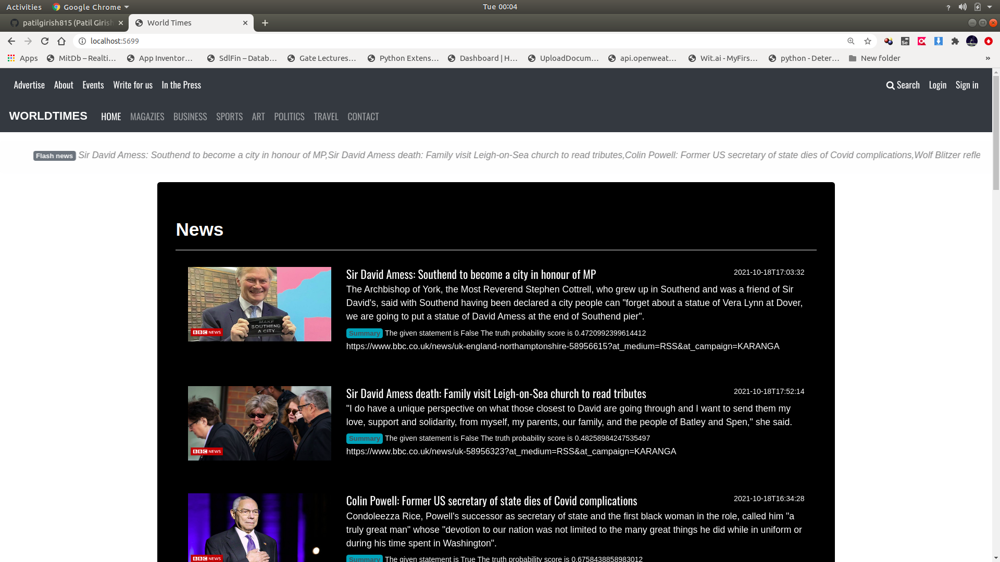
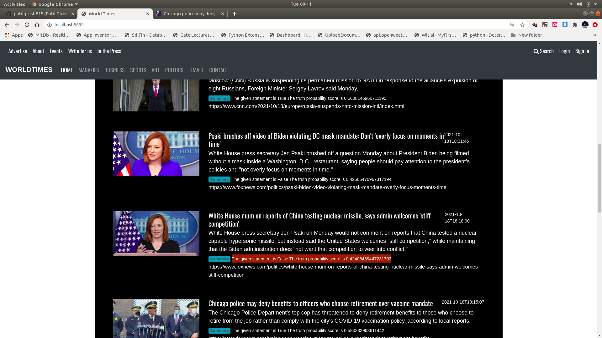
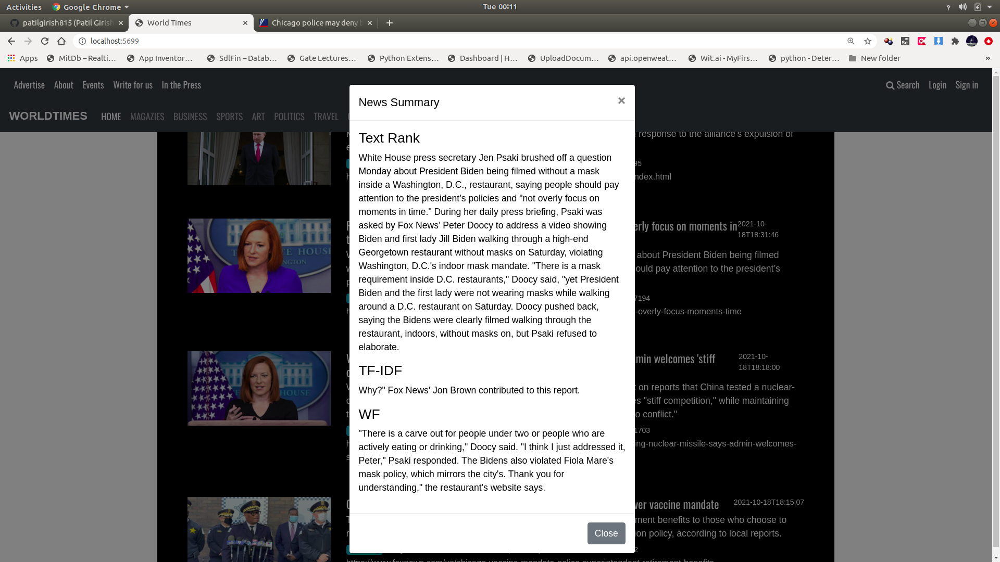

# Fake_News_Prediction_And_Summarization
The goal of this project is to scrape the latest published news from BBC News, Fox News, etc and get the truthfulness of news, and generate the news summary using Text Rank, TF-IDF and Word Frequency Algorithms  

### To run application

1. Install all libraries
$ pip install -r requirements.txt

2. Run the application
$ python app.py

3. In Browser open URL localhost:5000

#### Landing page with latest news

#### The truthfulness of news

#### News summarization

